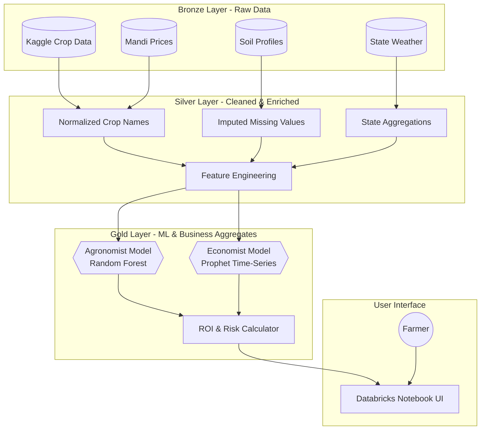

# AI-Powered Crop Recommendation System
## Intelligent Decision Support for Indian Farmers 🇮🇳

[](https://databricks.com/)
[](https://mlflow.org/)
[](https://delta.io/)
[](https://www.python.org/)

---

## Executive Summary
This project solves the "What should I grow?" dilemma for Indian farmers by combining **Agronomic Science** (soil/climate viability) with **Economic Forecasting** (market price trends). 

Unlike traditional systems that only check if a crop *can* grow, our dual-AI approach ensures farmers choose crops that are both **biologically viable** and **economically profitable**.


### Watch the Explainer

https://github.com/user-attachments/assets/b1fb6427-cf35-4c32-9085-fb0fb2fa48b6

---

## Problem Statement

### The Challenge
Indian farmers face critical decisions each planting season. Making the wrong choice leads to:
- **Yield Loss**: Up to 30% loss due to unsuitable soil/climate conditions.
- **Financial Ruin**: Market price crashes can wipe out a season's earnings.
- **Soil Degradation**: Improper crop rotation damages long-term soil health.

### Why Traditional Methods Fail
1. **Complexity**: Crop suitability depends on 7+ interconnected environmental factors.
2. **Market Volatility**: Prices fluctuate wildly; a good harvest means nothing if prices crash.
3. **Data Silos**: Farmers cannot manually analyze 20 years of soil, weather, and market data.

### Solution: Dual-Model AI Strategy

1. **The Agronomist (Random Forest)**: *"Can this crop grow here?"*
   - Analyzes N, P, K, pH, Temperature, Humidity, and Rainfall.

* **Purpose:** Recommends the optimal crop to plant based on soil composition (N, P, K) and weather conditions.
* **Rationale:** Chosen for its high accuracy on tabular data and ability to model complex, non-linear relationships between soil health and crop yield.

2. **The Economist (Facebook Prophet)**: *"Should I grow this crop?"*
   - Forecasts market prices 12 months into the future.
   - Calculates **Risk Volatility** and **Projected ROI**.
   
* **Purpose:** Forecasts market prices 12 months into the future to help farmers plan for profitability.
* **Rationale:** Selected for its robust handling of seasonal harvest cycles and resilience to missing or irregular market data points.


---

## Technical Architecture

We utilize the **Databricks Medallion Architecture** to transform raw data into actionable insights.



---

### 1. Data Sources (Integrated 5 Heterogeneous Datasets)

* **Crop Recommendation**: 2,200 samples (Soil nutrients, climate, pH).
* **Weather History (1997-2020)**: 24 years of granular climate data.
* **Mandi Market Prices**: 500k+ transactions for price forecasting.
* **Soil Profiles**: State-wise average N-P-K distributions.
* **Production Yields**: Historical yield-per-hectare statistics.

### 2. Machine Learning Workflow

| Component | Technology | Description |
| --- | --- | --- |
| **Classification** | Scikit-Learn Random Forest | Trained on 15 crops. Uses `MLflow` for experiment tracking and model registry. |
| **Forecasting** | Facebook Prophet | **Distributed Training** using PySpark `applyInPandas` to train 15 crop-specific models in parallel. |
| **Governance** | Unity Catalog | Full lineage tracking and access control. |

---

## Key Results

* **Market Insights**: Successfully captures seasonal price trends.
* **Impact**: Potential to increase farmer ROI by **20-25%** by avoiding high-risk/low-return crops.

---

## How to Run

1. **Clone the Repo**:
```bash
git clone https://github.com/Manjunathask/crop_recommendation_system.git

```


2. **Import to Databricks**: Upload the folders (`bronze`, `silver`, `gold`, `UI`) to your workspace.
3. **Setup Data**: Run `bronze_and_setup/00_setup_and_ingestion.ipynb` to initialize the Unity Catalog and download datasets.
4. **Run Pipeline**: Execute the Silver and Gold notebooks to train models.
5. **Launch UI**: Open `UI/02_main_ui_state_with_soil.ipynb`, enter your soil details (e.g., N=40, P=50, K=50), and view recommendations.

---

## Limitations & Assumptions (Read Before Use)

**IMPORTANT DISCLAIMER:** This project is a Proof of Concept (PoC) developed for educational purposes. The recommendations generated by this system are based on simulated and aggregated data and should NOT be used for actual real-world agricultural decision-making, farming, or financial planning.

To enable this demonstration, several assumptions and data manipulations were made:

### 1. Simulated Date Shift (The "2026" Logic)

**The Constraint:** Our reliable market price datasets extend only up to 2024, but the current context is 2026.

**The Modification:** To demonstrate the system's "Future Forecasting" capabilities in the current year, the model output dates have been artificially augmented by shifting them forward by 24 months in the Gold layer.

**Impact:** The prices shown are mathematical projections based on historical 2024 trends, not actual 2026 market conditions.

### 2. Geographic Generalization

**The Constraint:** High-quality, granular data (village/district level) was unavailable for all regions.

**The Modification:** We utilize State-Level Averages for soil profiles, rainfall, and weather data.

**Impact:** Real-world states (e.g., Maharashtra or Karnataka) have vast internal ecological diversity. Using state averages smoothes over critical local variations, meaning the model may recommend a moisture-loving crop for a state that is dry in your specific district.

### 3. Limited Crop Scope

**The Constraint:** The model is trained on a closed dataset containing only 15 specific crops.

**Impact:** In reality, Indian agriculture involves hundreds of unique crops and thousands of seed varieties. This system is forced to recommend a crop within its limited 15-crop vocabulary, potentially ignoring other viable or more profitable options outside this list.

### 4. Proof of Concept Nature

This project serves to demonstrate the Technical Architecture (Lakehouse, Medallion Architecture, Distributed Training) rather than Agronomic perfection. It serves as a blueprint showing that if precise, real-time, hyper-local data were ingested, this architecture could drive valuable insights.

---

## Future Roadmap

* [ ] **Mobile App**: React Native frontend for field usage.
* [ ] **IoT Integration**: Real-time soil sensors feeding into the Bronze layer.
* [ ] **Vernacular Support**: Hindi, Kannada, and Telugu language options.

---
## Acknowledgments

- **Kaggle**: For crop recommendation dataset
- **Databricks**: For sponsoring the AI challenge and platform
- **Codebasics & Indian Data Club**: For organizing the hackathon

---

## Contact

**Manjunath Ask**  
- GitHub: [@Manjunathask](https://github.com/Manjunathask)
- LinkedIn: [Manjunatha_S_K](https://www.linkedin.com/in/manjunatha-s-k/)
- Email: skmanjunath16@gmail.com

---

## License

This project is licensed under the MIT License - see the [LICENSE](LICENSE) file for details.

---

**Built with ❤️ for Indian farmers and sustainable agriculture**
---
**Built for the Databricks AI Challenge 2026**
